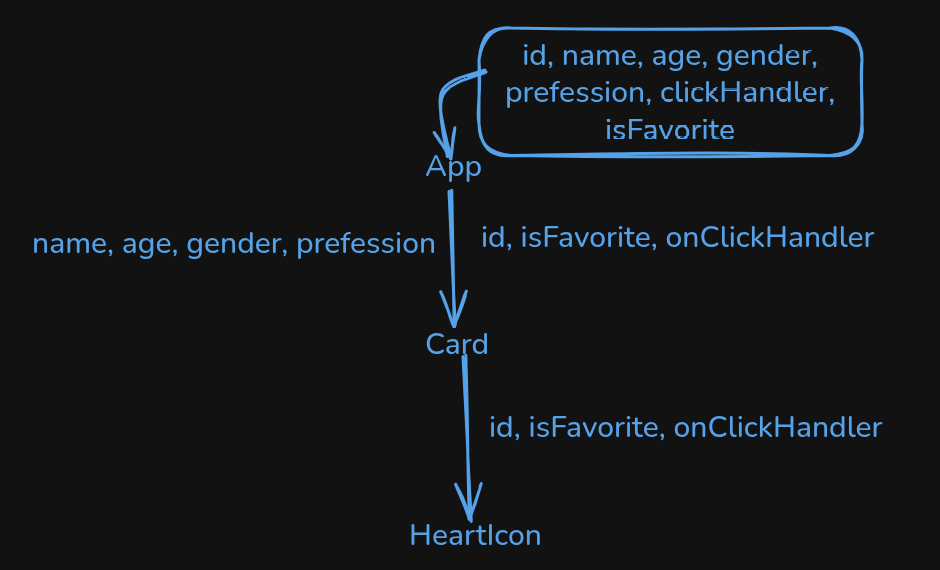

App.jsx

- [1] Component er kothay ki thake
- [2] jsx koto tuku & ki ki diye make kori
- [3] players.map er description
- [4] key={player.id} ki & keno likhi
- [5] {...player} keno likhi & likhle ki hoy
- [6] onClickHandler={clickHandler} diye ki bujhai

Card.jsx

- [1] props kun gula? kunta variable props & kunta funciton props
- [2] variable props k likhi kivabe
- [3] onClick={onClickHandler} kokhon likhi
- [4] onClick={onClickHandler(id)} likhle ki hoy
- [5] onClick={() => onClickHandler(id)} keno likhi
- [6] clickHandler function er kaj ki hoy
- [7] setPlayers((prevState) => {}) ei format e keno likhi
- [7] className={`text-red-600 hover:fill-red-600 ${isFavorite ? "fill-red-600" : ""}`} bolte ki bujhai

1. answer

- first e state declare/define
- majhe conditions, variables (const, let), functions
- last e must jsx return korte hoy
- overall: component is nothing but a function that must return jsx

2. jsx

- html + css + js code

## Short Circuit Condition / Operation in JavaScript (JSX)

## Operators:

(condition) && <JSX>, if condition true, then show the jsx

(condition) || <JSX>, if condition false, then show the jsx

---

## `&&` Usage:

```jsx
{
  condition && <JSXComponent />;
}
```

### ✅ What is Props Drilling in React?

Props Drilling means:

🔁 Passing data (props) from a parent component to a deeply nested child component through multiple layers, even when the middle components don’t use that data — they only pass it along.



🔁 What is Happening?

`App` has all data: `id`, `name`, `age`, `gender`, `profession`, `clickHandler`, `isFavorite`.

It passes:

`name`, `age`, `gender`, `profession` → to `Card`

`Card` doesn't need of `id`, `isFavorite`, `clickHandler` props

But `Card` passes `id`, `isFavorite`, `clickHandler` → to `HeartIcon` (those props are needed in `HeartIcon`).

## Passing props & children through a component

### `Card` parent component

```jsx
const Card = ({
  id,
  name,
  profession,
  age,
  gender,
  isFavorite,
  onClickHandler,
}) => {
  return (
    isFavorite && (
      <CardWrapper id="card" className="card">
        <p>
          <strong>Name:</strong> {name}
        </p>
        <HeartIcon
          id={id}
          onClickHandler={onClickHandler}
          isFavorite={isFavorite}
        />
      </CardWrapper>
    )
  );
};
```

- Props `id`, `className`
- Passing Children

```jsx
 <p>
    <strong>Name:</strong> {name}
 </p>
<HeartIcon
    id={id}
    onClickHandler={onClickHandler}
    isFavorite={isFavorite}
/>
```

### `CardWrapper` child component

`...restProps` means

`restProps` -> `{id: 'id1', className: 'cl'}`

```JSX
const CardWrapper = ({ children, ...restProps }) => {
  console.log("Children:", children);
  return <article {...restProps}>{children}</article>;
};
```

`<article {...restProps}>{children}</article>`

Here `{...restProps}` means

```jsx
<article id="id1" className="cl">
  ...
</article>
```

## Passing jsx as a props

- 1. Parent Component

```jsx

    <div>
      <Card
        title="Welcome"
        content={<p>This is some <strong>bold</strong> content passed as a prop!</p>}
      />

  ;
```

- 2. Child Component (Card.jsx)

```jsx
const Card = ({ title, content }) => {
  return (
    <div className="border p-4 rounded-md shadow-md">
      <h2 className="text-xl font-bold mb-2">{title}</h2>
      <div>{content}</div>
    </div>
  );
```

💡 What's Happening?

- passing `<p>...</p>` (a JSX element) as the content `prop`.

- Inside the Card component, render it with {content}.

- This is useful when I want a child to render custom JSX defined in the parent.

## Passing component as a props

- One component to another component as a prop

- Then render it inside the receiver component

1. Pass component as a prop

```jsx
<Wrapper CustomComponent={SomeComponent} />
```

2. Render inside the child

```jsx
const Wrapper = ({ CustomComponent }) => {
  return (
    <div>
      <h2>Inside Wrapper</h2>
      <CustomComponent /> {/* 👈 render passed component */}
    </div>
  );
};
```

### 🧠 Two-Way Binding মানে কী?

👉 Two-way binding মানে:

1. State ➡️ UI
2. UI ➡️ State

মানে:

ইনপুট ফিল্ডে যা লিখবো তা state এ যাবে।

আর state এ যা থাকবে, তা ইনপুটে দেখাবে।

দুই দিকেই ডেটা যাওয়া-আসা করে — তাই এর নাম two-way binding.

```jsx


const Example = () => {
  const [name, setName] = useState(""); // state তৈরি

  const handleChange = (e) => {
    setName(e.target.value); // ইনপুটে লেখা → state এ সেট
  };

  return (
    <div>
      <input
        type="text"
        value={name}           // state → input
        onChange={handleChange} // input → state
      />
      <p>Your name is: {name}</p> {/* state → UI */}
    </div>
  );
```

### ❌ যদি Two-way binding না করতেন?

ইনপুটে লিখতেন ঠিকই, কিন্তু state জানতো না কী লিখেছেন।

state আপডেট করলে ইনপুট জানতো না কী দেখাতে হবে।
