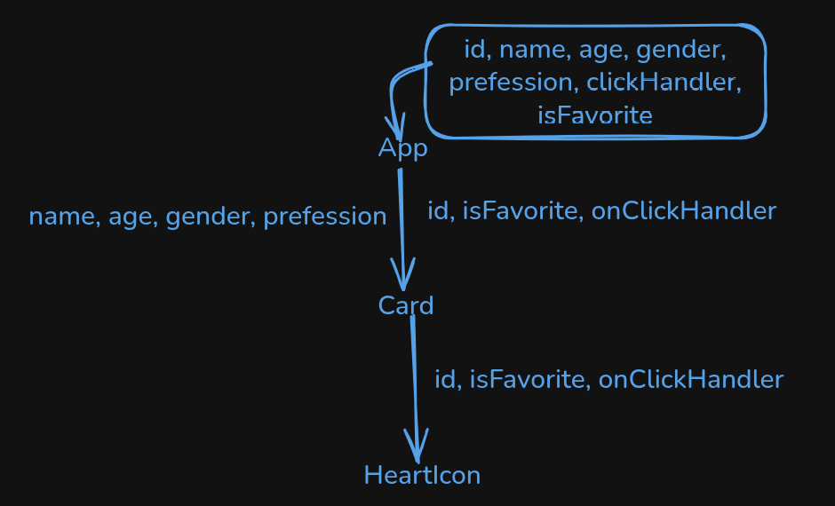

App.jsx

- [1] Component er kothay ki thake
- [2] jsx koto tuku & ki ki diye make kori
- [3] players.map er description
- [4] key={player.id} ki & keno likhi
- [5] {...player} keno likhi & likhle ki hoy
- [6] onClickHandler={clickHandler} diye ki bujhai

Card.jsx

- [1] props kun gula? kunta variable props & kunta funciton props
- [2] variable props k likhi kivabe
- [3] onClick={onClickHandler} kokhon likhi
- [4] onClick={onClickHandler(id)} likhle ki hoy
- [5] onClick={() => onClickHandler(id)} keno likhi
- [6] clickHandler function er kaj ki hoy
- [7] setPlayers((prevState) => {}) ei format e keno likhi
- [7] className={`text-red-600 hover:fill-red-600 ${isFavorite ? "fill-red-600" : ""}`} bolte ki bujhai

1. answer

- first e state declare/define
- majhe conditions, variables (const, let), functions
- last e must jsx return korte hoy
- overall: component is nothing but a function that must return jsx

2. jsx

- html + css + js code

## Short Circuit Condition / Operation in JavaScript (JSX)

## Operators:

(condition) && <JSX>, if condition true, then show the jsx

(condition) || <JSX>, if condition false, then show the jsx

---

## `&&` Usage:

```jsx
{
  condition && <JSXComponent />;
}
```

### ✅ What is Props Drilling in React?

Props Drilling means:

🔁 Passing data (props) from a parent component to a deeply nested child component through multiple layers, even when the middle components don’t use that data — they only pass it along.



🔁 What is Happening?

App has all data: id, name, age, gender, profession, clickHandler, isFavorite.

It passes:

name, age, gender, profession → to Card

id, isFavorite, clickHandler → also to Card (even though Card doesn’t need them)

Then Card passes id, isFavorite, clickHandler → to HeartIcon (which actually needs them).

## Passing props & children through a component

### `Card` parent component

```jsx
const Card = ({
  id,
  name,
  profession,
  age,
  gender,
  isFavorite,
  onClickHandler,
}) => {
  return (
    isFavorite && (
      <CardWrapper id="card" className="card">
        <p>
          <strong>Name:</strong> {name}
        </p>
        <HeartIcon
          id={id}
          onClickHandler={onClickHandler}
          isFavorite={isFavorite}
        />
      </CardWrapper>
    )
  );
};
```

- Props `id`, `className`
- Passing Children

```jsx
 <p>
    <strong>Name:</strong> {name}
 </p>
<HeartIcon
    id={id}
    onClickHandler={onClickHandler}
    isFavorite={isFavorite}
/>
```

### `CardWrapper` child component

...restProps means

restProps -> {id: 'id1', className: 'cl'}

```JSX
const CardWrapper = ({ children, ...restProps }) => {
console.log("Children:", children);
return <article {...restProps}>{children}</article>;
};
```

`<article {...restProps}>{children}</article>`

Here {...restProps} means

```jsx
<article id="id1" className="cl">
  ...
</article>
```
