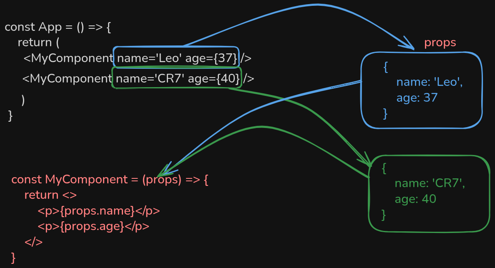
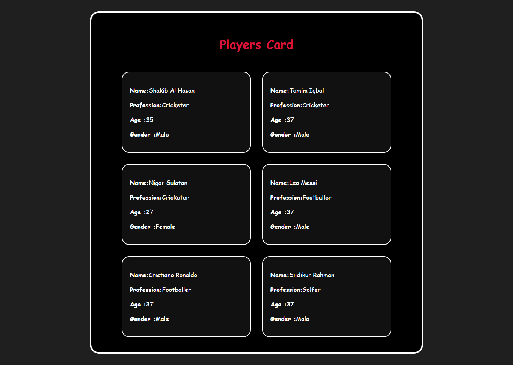

## 🧠 Make React Component More Dynamic Using Variables

Instead of writing hardcoded strings inside the component, we will:

✅ Store data in variables in the parent (`App.jsx`)

✅ Pass those variables as `props` to the child (`Card.jsx`)

✅ Use `props.name`, `props.age`, etc., inside the child component

# screenshots



## 🔧 Step 1: Parent Component (`App.jsx`)

## 📁 File: `src/App.jsx`

```jsx
import "./App.css";
import Card from "./Card/Card";

function App() {
  const name = "Shakib Al Hasan";
  const profession = "Cricketer";
  const age = "38";
  const gender = "Male";

  const name1 = "Tamim Iqbal";
  const profession1 = "Cricketer";
  const age1 = "37";
  const gender1 = "Male";

  const name2 = "Nigar Sultan";
  const profession2 = "Cricketer";
  const age2 = "27";
  const gender2 = "Female";

  const name3 = "Leo Messi ";
  const profession3 = "Footballer";
  const age3 = "38";
  const gender3 = "Male";

  const name4 = " Cristiano ronaldo";
  const profession4 = "Footballer";
  const age4 = "40";
  const gender4 = "Male";

  const name5 = "Siddikur rhaman";
  const profession5 = "Golfer";
  const age5 = "38";
  const gender5 = "Male";

  return (
    <main>
      <header>
        <h1>Player Name</h1>
      </header>
      <section className="card-container">
        <Card name={name} profession={profession} age={age} gender={gender} />
        <Card
          name={name1}
          profession={profession1}
          age={age1}
          gender={gender1}
        />
        <Card
          name={name2}
          profession={profession2}
          age={age2}
          gender={gender2}
        />
        <Card
          name={name3}
          profession={profession3}
          age={age3}
          gender={gender3}
        />
        <Card
          name={name4}
          profession={profession4}
          age={age4}
          gender={gender4}
        />
        <Card
          name={name5}
          profession={profession5}
          age={age5}
          gender={gender5}
        />
      </section>
    </main>
  );
}

export default App;
```

## 🔧 Step 2: Child Component (`Card.jsx`)

## 📁 File: src/Card/`Card.jsx`

Method:1

```jsx
const Card = (props) => {
  return (
    <article id="card" className="card">
      <p>
        <strong>Name: </strong>
        {props.name}
      </p>
      <p>
        <strong>Profession: </strong>
        {props.profession}
      </p>
      <p>
        <strong>Age: </strong>
        {props.age}
      </p>
      <p>
        <strong>Gender: </strong>
        {props.gender}
      </p>
    </article>
  );
```

Method:2
I can do destructure `props` as well

```js
const Card = (props) => {
  const { name, age, country, role } = props; // change here

  return (
    <div className="card">
      <h2>{name}</h2>
      <p>Age: {age}</p>
      <p>Country: {country}</p>
      <p>Role: {role}</p>
    </div>
  );
};
```

Method:3
I can do destructure `props` while receiving

```js
//change here
const Card = ({ name, age, country, role }) => {
  return (
    <div className="card">
      <h2>{name}</h2>
      <p>Age: {age}</p>
      <p>Country: {country}</p>
      <p>Role: {role}</p>
    </div>
  );
};
```

## 📦 Output (UI):



✅ Summary

| Step         | Description                                                        |
| ------------ | ------------------------------------------------------------------ |
| 1. Variables | Store player data in variables in the parent component             |
| 2. Props     | Send those variables to the child component using props            |
| 3. Dynamic   | This makes your code more dynamic and easy to update in the future |
