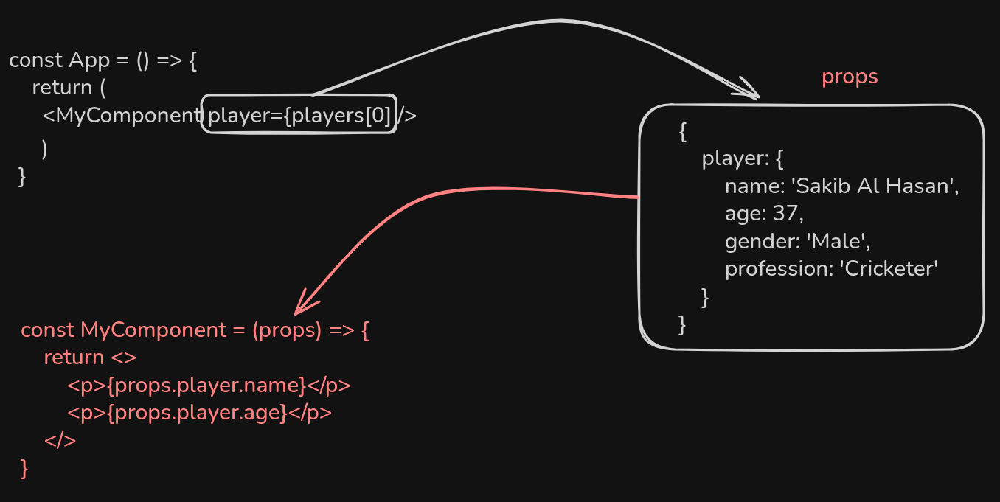

# 🧠 React: Store Player Info in a Separate File Using Object & Array

## ✅ Step-by-step Plan

1. Store each player as an object inside an array.
2. Export the array.
3. Import the array in `App.jsx`.
4. Use the array to render players with the `<Card />` component.
5. Use object destructuring (with default values) in the child component (`Card.jsx`).



## 📁 Step 1: Create `data.js`

This file holds all the player information.

```js
const players = [
  { name: "Shakib al Hasan", profession: "Cricketer", age: 38, gender: "Male" },
  { name: "Tamim Iqbal", profession: "Cricketer", age: 37, gender: "Male" },
  { name: "Nigar Sultana", profession: "Cricketer", age: 27, gender: "Female" },
  { name: "Leo Messi", profession: "Footballer", age: 37, gender: "Male" },
  {
    name: "Cristiano Ronaldo",
    profession: "Footballer",
    age: 40,
    gender: "Male",
  },
  { name: "Siddikur Rahman", profession: "Golfer", age: 38, gender: "Male" },
];

export default players;
```

## 📁 Step 2: Use the Array in App.jsx

```jsx
import "./App.css";
import Card from "./Card/Card";
import players from "./data";

function App() {
  return (
    <main>
      <header>
        <h1>Players Card</h1>
      </header>
      <section className="card-container">
        <Card player={players[0]} />
        <Card player={players[1]} />
        <Card player={players[2]} />
        <Card player={players[3]} />
        <Card player={players[4]} />
        <Card player={players[5]} />
      </section>
    </main>
  );
}

export default App;
```

## 📁 Step 3: Destructure Props in Card.jsx (with Default Value)

1. props,
   const {name, profession, age, gendere } = props.player

```jsx
   const Card = (props) => {
   const { name, profession, age, gender } = props.player;
```

2. { player }, const { name, profession, age, gender } = player
   must mention why use { player }
   as I am sending the data like player={players[0]}

```jsx
const Card = ({ player }) => {
  const { name, profession, age, gender } = player;
```

3. mention {...players[0]} from the parent and receive { name, profession, age, gender } (direct destructing the object.
   <Card {...players[0]} /> is like passing the value <Card name={name} age={age} />

```jsx
import React from "react";
import "./Card.css";

const Card = ({ name, profession, age, gender = "Male" }) => {
  return (
  );
};

export default Card;
```

```jsx

        <Card {...players[0]} />
        <Card {...players[1]} />
        <Card {...players[2]} />
        <Card {...players[3]} />
        <Card {...players[4]} />
        <Card {...players[5]} />


```

## 📦 Output (UI):


