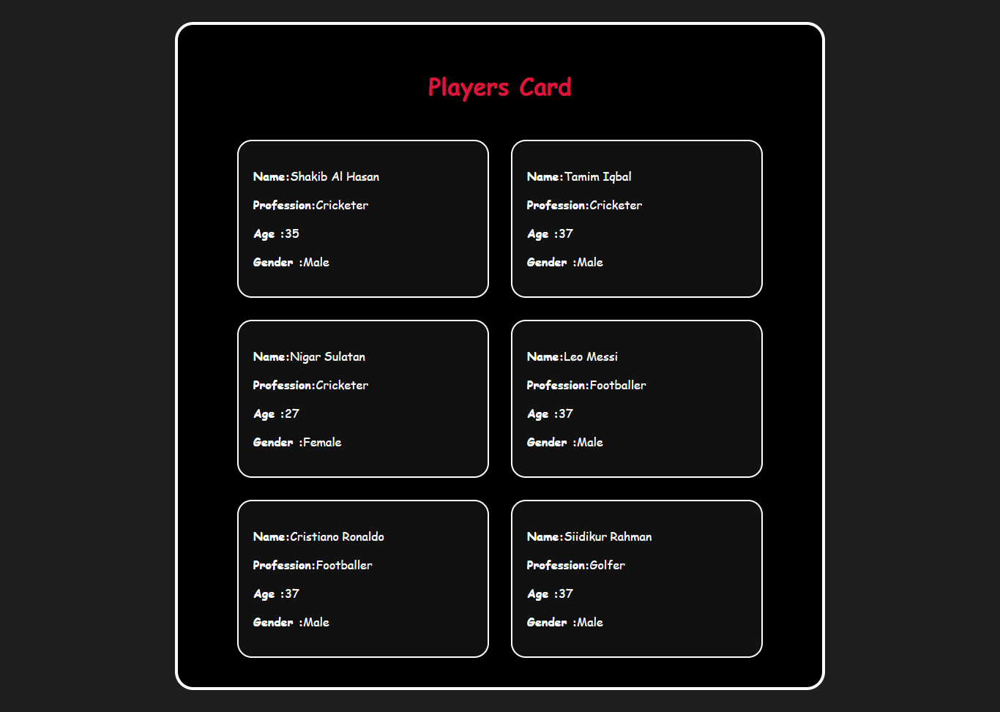

# 🧠 React: Store Player Info in a Separate File Using Object & Array

## ✅ Step-by-step Plan

1. Store each player as an object inside an array.
2. Export the array.
3. Import the array in `App.jsx`.
4. Use the array to render players with the `<Card />` component.
5. Use object destructuring (with default values) in the child component (`Card.jsx`).


## 📁 Step 1: Create `data.js`

This file holds all the player information.

```js
const players = [
  { name: "Shakib al Hasan", profession: "Cricketer", age: 38, gender: "Male" },
  { name: "Tamim Iqbal", profession: "Cricketer", age: 37, gender: "Male" },
  { name: "Nigar Sultana", profession: "Cricketer", age: 27, gender: "Female" },
  { name: "Leo Messi", profession: "Footballer", age: 37, gender: "Male" },
  {
    name: "Cristiano Ronaldo",
    profession: "Footballer",
    age: 40,
    gender: "Male",
  },
  { name: "Siddikur Rahman", profession: "Golfer", age: 38, gender: "Male" },
];

export default players;
```

## 📁 Step 2: Use the Array in App.jsx

```jsx
import "./App.css";
import Card from "./Card/Card";
import players from "./data";

function App() {
  return (
    <main>
      <header>
        <h1>Players Card</h1>
      </header>
      <section className="card-container">
        <Card player={players[0]} />
        <Card player={players[1]} />
        <Card player={players[2]} />
        <Card player={players[3]} />
        <Card player={players[4]} />
        <Card player={players[5]} />
      </section>
    </main>
  );
}

export default App;
```

## 📁 Step 3: Destructure `props` in `Card.jsx` (with Default Value)

1. Destruture `player`

```jsx
const Card = (props) => {
  const { name, profession, age, gender } = props.player; // Change here

  // Rest of the code
};
```

2. I can do destructure while receiving

As I am sending the data from `App.jsx` (parent) like `player={players[0]}`, receiving like `{ player }`

```jsx
// Change here
const Card = ({ player }) => {
  const { name, profession, age, gender } = player;

  // Rest of the code
};
```

3. Use `{...players[0]}`, sending data from the parent and receiving as `props` like `{ name, profession, age, gender }` (direct destructing the object.)

`<Card {...players[0]} />` is like passing the value `<Card name={name} age={age} />`

```jsx
const Card = ({ name, profession, age, gender }) => {
  // Rest of the code
};
```

4. As receiving the value like `{ name, profession, age, gender }`, then I can use last variable as default parameter

```jsx
const Card = ({ name, profession, age, gender = "Male" }) => {
  // Rest of the code
};
```

_Note:_ I can use default parameter more than one but make sure it will turn as default parameter from the right

```jsx
// More than one default parameter
const Card = ({ name, profession, age = 30, gender = "Male" }) => {
  // Rest of the code
};
```

_Note:_ Use default parameter only when destructure the `props` while receiving

## 📦 Output (UI):


