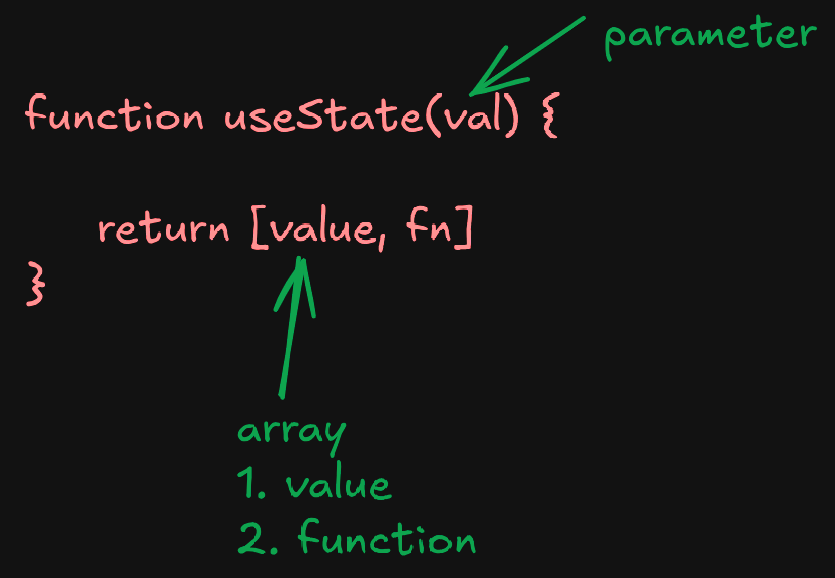
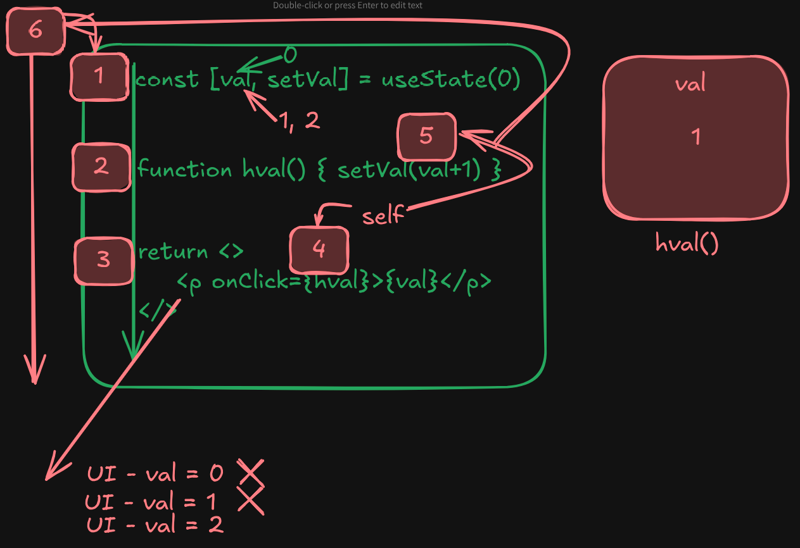

## Rules of Hooks

1. **Hook names must start with `use`**  
   All React hooks must begin with the word `use`. For example: `useState`, `useEffect`.

2. **Hooks must be declared inside a component**  
   You should only call hooks like `useState` or `useEffect` **inside React functional components** or **custom hooks**.

3. **Hook should be declare top of the componet**  
   Always call them at the **top level of your component** to ensure consistent behavior across renders

4. **Don't use hooks inside conditional statements**  
   Hooks should **not be called inside if/else, loops, or nested functions**.

## 🔄 What is `state` in React?

`state` is a special variable in React that holds data that can change over time. When the `state` changes, React re-renders the component to show the updated UI.

`State` হল React-এর একটি বিশেষ ভেরিয়েবল, যা কোনো কম্পোনেন্টের মধ্যে ডেটা সংরক্ষণ করে।

এই ডেটা যদি পরিবর্তিত হয়, তাহলে React স্বয়ংক্রিয়ভাবে কম্পোনেন্টটিকে পুনরায় রেন্ডার করে, অর্থাৎ নতুন UI দেখায়।

## We use `state` in React to:

Store changing data in a component

Component-এর ভেতরে changing data store করার জন্য

Automatically update the UI when the data (state) changes

যখন এই data change হয়, React নিজে নিজে UI update করে

Trigger re-rendering of the component

State change মানেই React নতুন করে component render করে

🟢 Without `state` — data can change, but UI won’t update

🛑 যদি normal variable use করি → data change হলেও UI change হয় না

```jsx
function App() {
  let count = 15;
  const clickHandler = () => {
    console.log("Clicked");
    count = 20;
  };

```

# output


🟢 With `state` — data changes → React updates UI

✅ কিন্তু state use করলে → React UI automatically update করে

```jsx
function App() {
  const [count, setCount] = useState(15);
  const clickHandler = () => {
    console.log("Clicked");
    setCount(20);
  };
}
```

# output


## Rules of useState

1. `useState` takes **one parameter**, which is the **default value** (initial state).

2. `useState` **returns an array** with **two elements**(length 2).

3. The **first element** of the array is the **current state value**,  
   and the **second element** is a **function to update that value**.

## "Why do we create functions inside a React component instead of outside?"

We usually create functions inside a React component when that function needs to use or update state, `props`, or needs to stay connected with the component’s internal behavior.

React কম্পোনেন্টের ভিতরে ফাংশন লিখলে, সেই ফাংশন সহজেই কম্পোনেন্টের state এবং props ব্যবহার করতে পারে। কারণ, সেই ফাংশন কম্পোনেন্টের context-এর মধ্যে থাকে।

যখন আমরা কোনও বাটন ক্লিক, ইনপুট পরিবর্তন বা কম্পোনেন্টের ভেতরের কোনো ইভেন্ট হ্যান্ডেল করতে চাই — তখন ফাংশনটি কম্পোনেন্টের ভিতরেই লিখি।
এতে করে ফাংশনটি সরাসরি কম্পোনেন্টের ডেটা অ্যাক্সেস করতে পারে এবং UI কে ঠিকভাবে রেন্ডার করতে সাহায্য করে।

```jsx
function Counter() {
  const [count, setCount] = useState(0);

  // 👉 This function is inside because it uses state
  function handleClick() {
    setCount(count + 1);
  }

  return <button onClick={handleClick}>Clicked: {count}</button>;
}
```

Here, handleClick() is written inside because:

It uses the component’s count state.

It updates state using setCount.

✅ Main Reasons:

| Reason                         | Explanation                                                            |
| ------------------------------ | ---------------------------------------------------------------------- |
| **1. Access to state & props** | Inside functions can directly use `state`, `props`, and hooks.         |
| **2. Closure support**         | The function “remembers” the values from its component at render time. |
| **3. Clean and scoped logic**  | It keeps component-specific logic inside the component.                |
| **4. Easier to read**          | Function is close to the JSX and logic it relates to.                  |

## 🔸 When do we write functions outside?

We write outside when:

It doesn’t need state or props.

It's reusable across components.

```js
function calculateTotal(price, tax) {
  return price + price * tax;
}
```

## What is initial state in React?

In React, `initial state` mane holo — jokhon kono component first time render hoy, tokhon je default value ta state variable er moddhe thake, seta ke amra boli initial state.

React e state holo ekta special variable, ja amra useState() hook diye declare kori. Ei state er value change hole component automatic re-render hoy.

```js
const [name, setName] = useState("Hasan"); // "Hasan" is the initial state
```



## React state life cycle



Step 1: State Declaration

```jsx
const [val, setVal] = useState(0);
```

val is the state variable (initially 0).

setVal is the function used to update val.

Step 2, hval is a function.

"React internally keeps track of the state variable val (initially 0) and the hval function."

Step 3: JSX Render

React displays the component’s JSX in the user interface.

```js
return <p onClick={hval}>{val}</p>;
```

Step 4: onClick

Clicking the element calls hval().

hval is a function reference, not a function call.

Inside hval, setVal(val + 1) is called, which schedules a state update.

This triggers a re-render of the component.

Step 5: Re-render Trigger

setVal() updates the state.

This triggers React to re-render the component.

React goes back to Step 1 with the new val, and the cycle continues.
