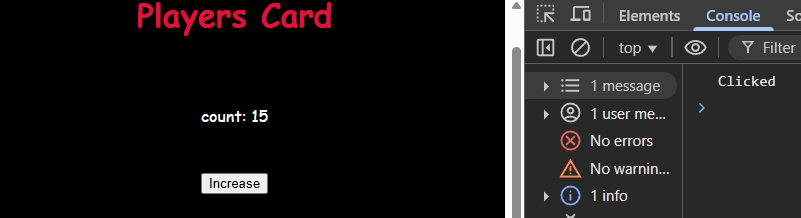
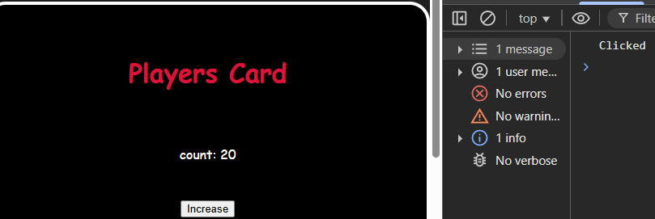

## Rules of Hooks

1. **Hook names must start with `use`**  
   All React hooks must begin with the word `use`. For example: `useState`, `useEffect`.

2. **Hooks must be declared inside a component**  
   You should only call hooks like `useState` or `useEffect` **inside React functional components** or **custom hooks**.

3. **Hook should be declare top of the componet**  
   Always call them at the **top level of your component** to ensure consistent behavior across renders

4. **Don't use hooks inside conditional statements**  
   Hooks should **not be called inside if/else, loops, or nested functions**.

## 🔄 What is `state` in React?

`state` is a special variable in React that holds data that can change over time. When the `state` changes, React re-renders the component to show the updated UI.

`State` হল React-এর একটি বিশেষ ভেরিয়েবল, যা কোনো কম্পোনেন্টের মধ্যে ডেটা সংরক্ষণ করে।

এই ডেটা যদি পরিবর্তিত হয়, তাহলে React স্বয়ংক্রিয়ভাবে কম্পোনেন্টটিকে পুনরায় রেন্ডার করে, অর্থাৎ নতুন UI দেখায়।

## We use `state` in React to:

Store changing data in a component

Automatically update the UI when the data (state) changes

Trigger re-rendering of the component

## React-এ আমরা state ব্যবহার করি কারণ:

Component-এর ভেতরে changing data store করার জন্য

যখন এই data change হয়, React নিজে নিজে UI update করে

State change মানেই React নতুন করে component render করে

🟢 Without `state` — data can change, but UI won’t update
🛑 যদি normal variable use করি → data change হলেও UI change হয় না

```jsx
function App() {
  let count = 15;
  const clickHandler = () => {
    console.log("Clicked");
    count = 20;
  };

```

# output



🟢 With `state` — data changes → React updates UI

✅ কিন্তু state use করলে → React UI automatically update করে

```jsx
function App() {
  const [count, setCount] = useState(15);
  const clickHandler = () => {
    console.log("Clicked");
    setCount(20);
  };
}
```

# output



## Rules of useState

1. `useState` takes **one parameter**, which is the **default value** (initial state).

2. `useState` **returns an array** with **two elements**(length 2).

3. The **first element** of the array is the **current state value**,  
   and the **second element** is a **function to update that value**.
