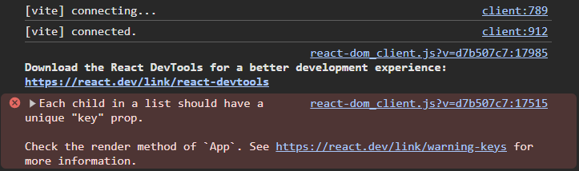

# 🧠 React: Store Player Info in a Separate File Using Object & Array

## ✅ Step-by-step Plan

1. Use object destructuring (with default values) in the child component (`Card.jsx`).

2. For a more dynamic, use the `players` array with `.map()` to render `<Card />` components multiple times. Pass player data using `{...player}` and include a unique `key`. While using map, I must provide extra `key` `props` otherwise React will complain an error.

```jsx
import players from "./data";

function App() {
  return (
    <section className="card-container">
      {players.map((player, index) => {
        return <Card key={index} {...player} />;
      })}
    </section>
  );
}
```

## 📁 Destructure `props` in Card.jsx

As I am passing the data using `{...player}` then receving like the following style

```jsx
const Card = ({ name, profession, age, gender = "Male" }) => {
  return (
    <article id="card" className="card">
      <p>
        <strong>Name:</strong> {name}
      </p>
      <p>
        <strong>Profession:</strong> {profession}
      </p>
      <p>
        <strong>Age:</strong> {age}
      </p>
      <p>
        <strong>Gender:</strong> {gender}
      </p>
    </article>
  );
};
```

While using `map`, I must provide an extra `key` `props` (`<Card key={index} {...player} />`). Otherwise React will complain an error.



Suppose you are my interview taker. You want to judge my React skill. So, you are asking the following questions
Questions:
- Why use key props?
- Why use `key={index}`
- The problem of using `key={index}`
- What is the solution?

Now, as a new fresher React frontend dev. What type of answer do you want from me? Please write it accordingly.

---

- `React.Fragment`
- `Fragment`
- `<></>`

## 📦 Output (UI):


