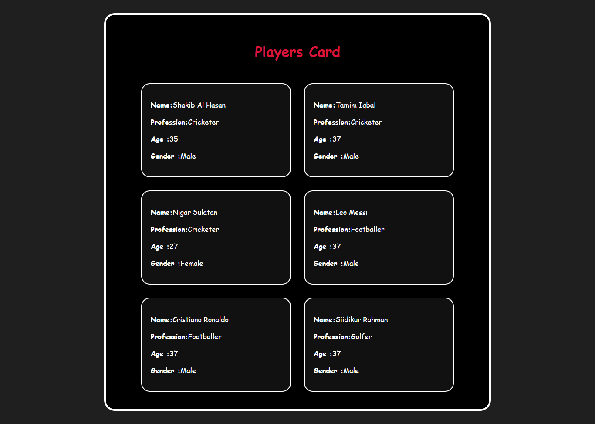

# 🧠 React: Store Player Info in a Separate File Using Object & Array

## ✅ Step-by-step Plan

1. Store each player as an object inside an array.
2. Export the array.
3. Import the array in `App.jsx`.
4. For a more dynamic, use the `players` array with `.map()` to render `<Card />` components. Pass player data using `{...player}` and include a unique `key`.\*\*

5. Use object destructuring (with default values) in the child component (`Card.jsx`).

## 📁 Step 1: Create `data.js`

This file holds all the player information.

```js
const players = [
  { name: "Shakib al Hasan", profession: "Cricketer", age: 38, gender: "Male" },
  { name: "Tamim Iqbal", profession: "Cricketer", age: 37, gender: "Male" },
  { name: "Nigar Sultana", profession: "Cricketer", age: 27, gender: "Female" },
  { name: "Leo Messi", profession: "Footballer", age: 37, gender: "Male" },
  {
    name: "Cristiano Ronaldo",
    profession: "Footballer",
    age: 40,
    gender: "Male",
  },
  { name: "Siddikur Rahman", profession: "Golfer", age: 38, gender: "Male" },
];

export default players;
```

📁 Step 2: Use the Array in App.jsx

```jsx
import "./App.css";
import Card from "./Card/Card";
import players from "./data";

function App() {
  return (
    <main>
      <header>
        <h1>Players Card</h1>
      </header>
      <section className="card-container">
        {players.map((player, index) => {
          console.log(player);
          return <Card key={index} {...player} />;
        })}
      </section>
    </main>
  );
}

export default App;
```

📁 Step 3: Destructure Props in Card.jsx (with Default Value)

```jsx
import React from "react";
import "./Card.css";

const Card = ( { name, profession, age, gender = "Male" }) => {
  return (
    <article id="card" className="card">
      <p>
        <strong>Name:</strong> {name}
      </p>
      <p>
        <strong>Profession:</strong> {profession}
      </p>
      <p>
        <strong>Age:</strong> {age}
      </p>
      <p>cd
    </article>
  );
};

export default Card;
```

📦 Output (UI):

